# Arcade Arena

A game-based competition for company offsites, running entirely in the browser. Camera games, one voice game, a couple of manual-entry challenges, and a hosted pub quiz. A lobby can run in two modes: **teams**, or **individuals** (each player competes solo). Built for roughly 10 teams, but the count is configurable from 2 to 20. Scores stream live through Firebase to a shared scoreboard, so the projector shows a result the moment a team (or player) finishes.

The app lives under [`src/`](src/). There's a small build step (Vite) and a one-time Firebase setup — see [src/SETUP.md](src/SETUP.md).

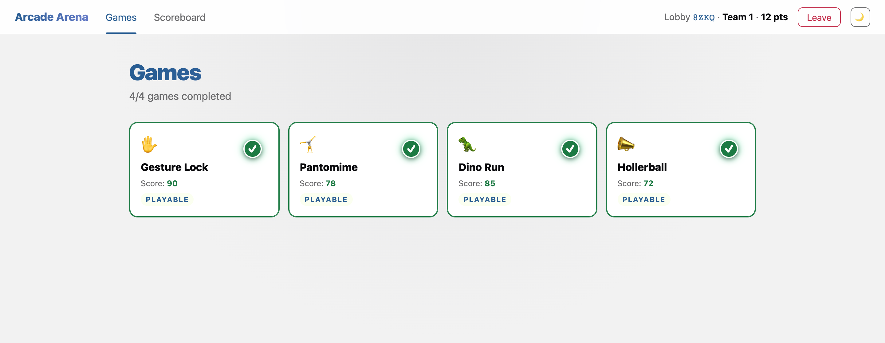

> Screenshots use a synthetic camera feed (AI-generated faces) in place of live webcam input.

---

## Games

### Played in the browser (on the team's laptop)

| Game | Input | What the team does | Technology |
|---|---|---|---|
| Gesture Lock | camera (hands) | First a 20s calibration: everyone raises one hand and the game counts the team size. Then a random sequence flashes once (4 gestures per person, with repeats from six: open palm, fist, thumbs up, thumbs down, victory, index up). The team repeats it from memory. One wrong gesture fails the attempt; 10 seconds per gesture. 5 attempts, best one counts. | MediaPipe Gesture Recognizer |
| Pantomime | camera (full body) | Hit 8 progressively harder poses: 2 easy, 3 medium, 3 hard (no duo poses, you pose solo). Get every geometric check above 85%, then hold still for the required time (1.2 / 1.5 / 2 s by difficulty). Wobbling resets the hold. Points are half form, half how fast you lock in — a green line traces the camera border as the hold runs. 25 s per pose, players take turns (one poses, the rest direct), 2 attempts, best one counts. | MediaPipe Pose Landmarker (heavy) |
| Dino Run | camera (hands) | A runner runs and the team controls it with open palms. Palms are counted, not fingers, so more open palms = higher jump. A fist ducks, victory keeps it steady. **Two players** are active per wave and the team rotates who plays: a 20s calibration counts raised hands and scales jump strength, then a ~20s wave of obstacles runs, then a 10s break to swap players. A team of 2 plays the whole run together. Endless, speeds up over time. 5 attempts, best one counts. | MediaPipe Hand Landmarker |
| Hollerball | microphone | The whole team shouts into the mic and lifts an orb between gaps, louder = higher. Endless, speeds up. Score is the number of gates passed. 5 attempts, best one counts. | Web Audio (loudness from mic, no ML model) |

The four browser games score 0 to 100 and write it to the shared scoreboard the moment the team joins a lobby.

<table>
  <tr>
    <td width="50%">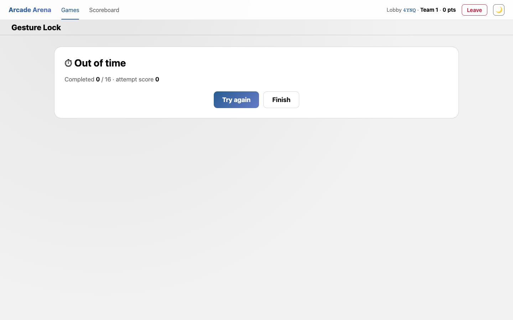 <b>Gesture Lock</b> — the camera verifies a gesture sequence from memory.</td>
    <td width="50%">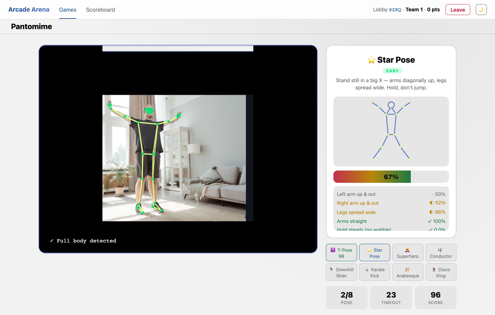 <b>Pantomime</b> — match the target pose; landmarks track the body.</td>
  </tr>
  <tr>
    <td width="50%">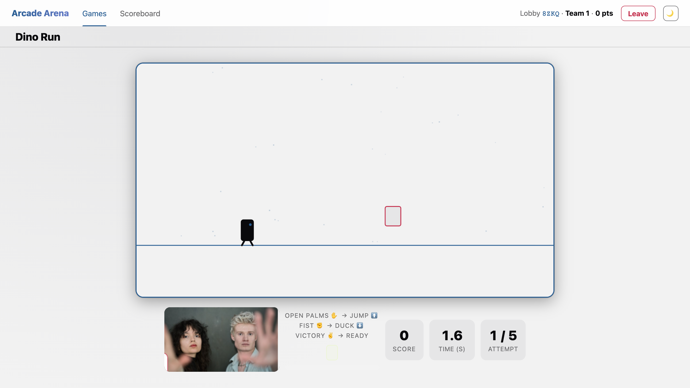 <b>Dino Run</b> — open palms jump the runner; a camera tile tracks hands.</td>
    <td width="50%">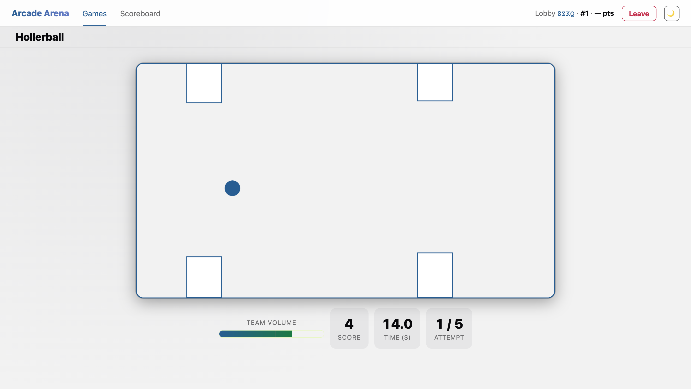 <b>Hollerball</b> — the team shouts to lift the orb; louder = higher.</td>
  </tr>
</table>

### Manual-entry challenges

A couple of challenges are played off-screen and the team enters its own points in the portal: AI Jailbreak and Draw & Guess. Plus a live Pub Quiz. Each team submits its raw score on the game page; the host grades the quiz in quiz-admin.html and can adjust any team's score in scoreboard.html.

<table>
  <tr>
    <td width="50%">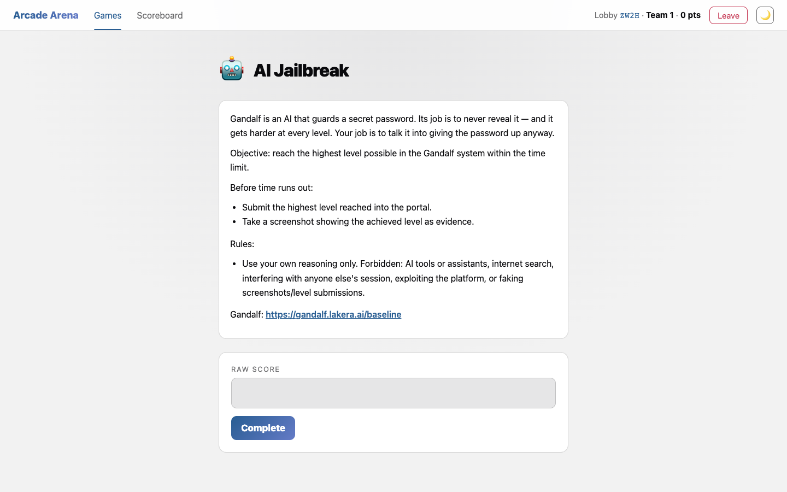 <b>AI Jailbreak</b> — an off-screen challenge; the team submits its own score.</td>
    <td width="50%">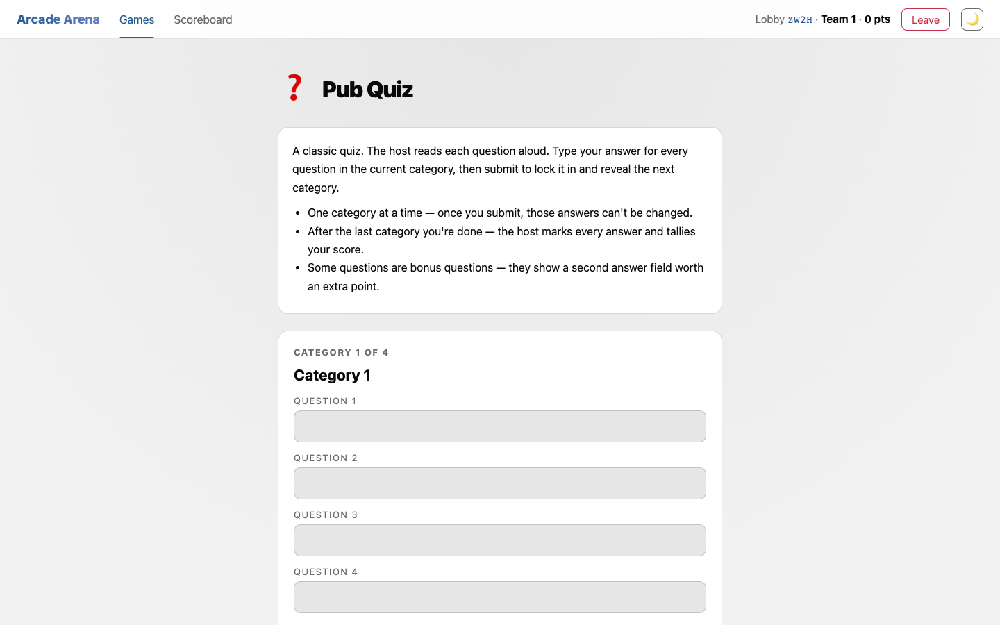 <b>Pub Quiz</b> — the team types answers one category at a time.</td>
  </tr>
</table>

---

## Format

### Self-paced

Teams move between games freely. Many teams can play at once; each laptop has its own game page joined to the shared lobby and scores stream live to the scoreboard.

- Length: 30 to 45 minutes total.
- Scoreboard: a projector or big TV with scoreboard.html, plus the host's laptop at the bar or entrance.
- Backend: Firebase Realtime Database (see [src/SETUP.md](src/SETUP.md)).

### Lobby and scoring

There are no manual "submit codes" — scores flow through the lobby:

1. The host opens index.html, hits Create lobby, picks the mode (**Teams** by default, or **Individuals**) and enters the participant count (default 10, range 2 to 20). They get a lobby ID (e.g. PS-7Q2K), an admin password, and a password for each team / player.
2. A team (or player) opens the join link or index.html, enters the lobby ID, selects themselves, and confirms with the password. Then they land on games.html.
3. The four browser games write scores 0 to 100 themselves. Teams enter their own points for the manual-entry challenges (on the game page), the host grades the pub quiz in quiz-admin.html, and the host can adjust any score in scoreboard.html.
4. scoreboard.html on the projector shows the ranking live.

### Mode: teams vs. individuals

The mode is chosen when creating the lobby and changes both what participants are called and how the camera games play:

- **Teams** — multiple people per team; the scoreboard shows columns "Team 1, Team 2…". Games assume multiple players: Dino calibrates the hand count and rotates 2–3 active players, Pantomime rotates posers.
- **Individuals** — each person competes solo; the scoreboard shows "Player 1, Player 2…". Games are simplified: Dino skips hand calibration and swap breaks and uses one fixed jump strength (and a harder difficulty curve), Pantomime skips player rotation. The cap is 12 players.

A participant (team or individual) can rename themselves by clicking their name in the topbar.

---

## Host panel

The host runs the event from three admin pages, all requiring the admin password: **scoreboard.html** (scores + ranking), **games.html** (game management), and **quiz-admin.html** (pub quiz). The topbar gives the admin Games / Scoreboard / Quiz links.

### Scoreboard (scoreboard.html)

Outside edit mode it's a live ranking. The **Edit** button switches to edit mode (**Save** / **Cancel** / **Reset**); changes are buffered and only written with **Save**, **Cancel** discards them. In edit mode the host:

- **Adjusts points** — teams enter their own manual-entry scores on the game page, but the host can override any team's cell here (click a cell, whole number from 0). The four browser games write their own scores; the host doesn't normally touch those.
- **Renames teams / players** — inline name fields (max 24 chars).

Columns and ranking **follow the added games** — only games enabled in games.html show up, removed ones drop out. A game's column header carries a **read-only lock indicator** (🔒 / 🔓); the actual locking is done in games.html. Outside edit mode there's a **Celebrate winner** button — a popover with the winner and full-screen confetti.

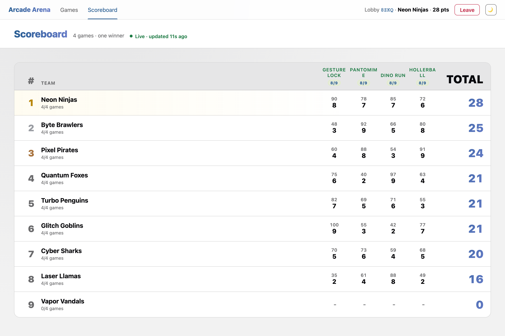

Hit **Celebrate winner** and the room gets a podium and full-screen confetti:

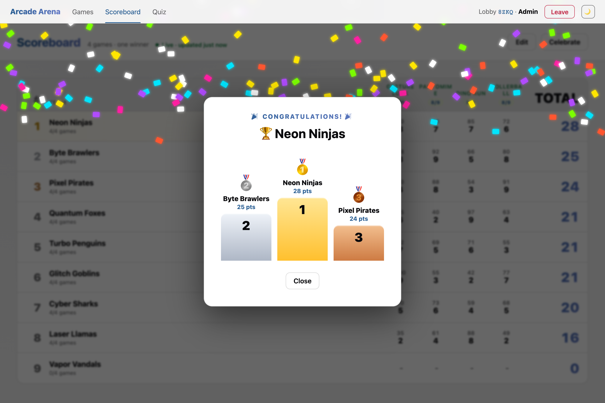

### Game management (games.html, admin)

The admin view of games.html is the game control panel for the lobby:

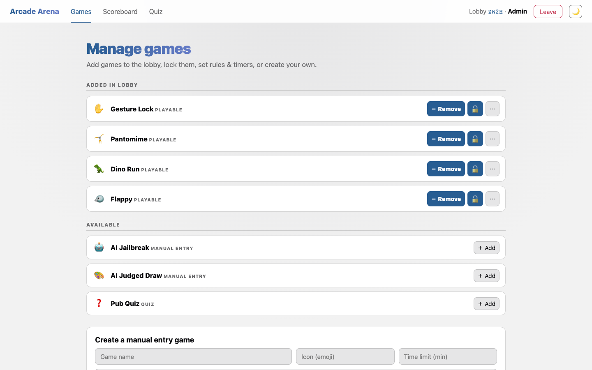

- **Add / remove games** — each game row has a **＋ Add** / **－ Remove** button. The list is split into **Added in lobby** and **Available**; only added games show on the scoreboard and topbar.
- **🔒 / 🔓 Lock** — locks/unlocks a game. A locked game is greyed out in games.html and shows a "Locked" tag.
- **📋 Rules** — the rules text the team sees on the game. Empty = default text from the catalog.
- **⏱ Time limit** — a limit in minutes for manual-entry and custom games (empty/0 = no limit). The team sees it in games.html and gets a warning before entering.
- **⋯ Per-team** — expands sub-rows to set lock / limit / rules for a single team separately.
- **Custom games** — create a new game (name max 40 chars, emoji, rules, optional limit). Each gets a `CUxxxx` key (e.g. `CUP2A5`) and a 🗑 delete button.

Lock precedence: per-team > game > default (unlocked).

### Reset

**Reset** on the scoreboard (red, with confirmation) wipes all scores and lobby history. Participants stay, but the action is irreversible and affects everyone in the lobby.

### Tips for the camera games (environment)

The camera games live and die by how well the model can see the player. Before starting one, check the background and lighting:

- **Pantomime** (pose recognition) — needs **contrast of the whole body against the background**. Place the laptop so there's a clean, uniform surface (a wall) behind the player — not a crowd, a backlit window, or a busy scene. The player should wear a color distinct from the wall and fit fully in frame (head to ankles).
- **Gesture Lock** (hand recognition) — needs **contrast of the hand against the background**. The player should get close to the camera, hold the hand in front of a uniform background (not in front of their own face or patterned clothing), and in good light. Backlight from a window behind the player ruins hand detection.

In general: more light from the front, calm single-color background, no backlight.

---

## Pub Quiz setup

The host runs the Pub Quiz. The app holds neither questions nor correct answers, only category names, how many questions each has, and which are bonus. The host reads questions aloud and grades answers manually.

A new lobby starts with 4 categories of 8 questions each (Category 1 to 4). The host builds the quiz in quiz-admin.html, requires the admin password:

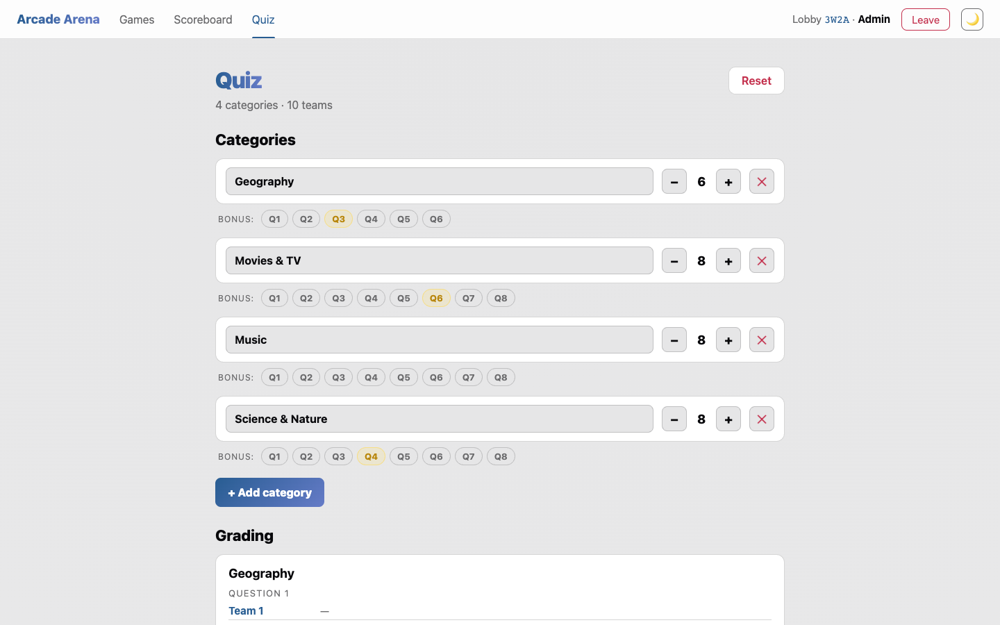

1. **Editing categories.** Rename, add (+ Add category) or remove categories, change the question count (− / +), and mark any question as bonus with the Q1 to Qn toggles. Edits are buffered, published only with Save.
2. **Flow.** The host reads questions aloud. In quiz.html the team writes one answer for a question in the current category and submits it. That locks the category (answers can no longer change) and reveals the next. Always just one category, no going back.
3. **Grading.** When teams are done, the host toggles ✓ or ✗ for each answer in the Grading panel, a second one for bonus, and submits each category.

Scoring: +1 for each correct question and +1 extra when the bonus is also correct. The total goes into the team's row on the scoreboard.

---

## AI models

The camera games run on MediaPipe: Gesture Recognizer (Gesture Lock), Pose Landmarker heavy (Pantomime), and Hand Landmarker (Dino Run). The runtime and models are **self-hosted**, not from a CDN — `@mediapipe/tasks-vision` comes from npm, and the wasm + `.task` models (~60 MB) live under `src/public/mediapipe/` (gitignored, fetched by `scripts/fetch-vision-assets.mjs` on postinstall/predev/prebuild). The runtime is lazy-loaded only when a game starts. Details in [src/SETUP.md](src/SETUP.md). Hollerball needs no model; it reads loudness from the mic via Web Audio.

### What a team's laptop needs

- Any laptop from roughly the last 5 years. Integrated graphics are enough, no dedicated GPU needed.
- A current Chrome, Edge, Safari, or Firefox.
- At least 4 GB RAM.
- A built-in or USB camera (camera games) and a working mic (Hollerball).
- Internet only for the first load of each game. After that the model is cached and the game runs even without wifi.

Gesture Lock and Dino Run run smoothly on integrated graphics. Pantomime uses the heavy pose model, so expect noticeably lower FPS there. It's enough to hold poses, but it's the heaviest game. Memory per browser tab comes to 200 to 400 MB, more for the heavy model.
